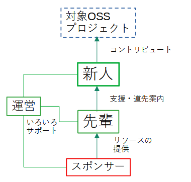

OSS Gateオンボーディングは「継続的にOSSを開発する人」を増やすことを目指す取り組みです。

## 背景

ユーザーも開発に参加する自由があるOSSは広く使われるようになりましたが、作る人と使う人の間には壁があります。作る人は「使う人はもっと開発に参加してくれるといいのに」と思うことも多く、使う人は「自分なんかが開発に参加するなんておこがましい」と思うことも多いです。

そんな作る人と使う人の壁をできるだけ取り除ければOSSがさらに有用な世界につながるでしょう。それは作る人にも使う人にもうれしい世界なはずです。

## 実現方法

OSS Gateオンボーディングでは「開発者が増えて欲しい」作る人と「開発に参加したい」使う人をマッチングし、「開発に参加したい」使う人が「継続的に開発に参加する人」になることを支援します。

「開発者が増えて欲しい」作る人と「開発に参加したい」使う人の間に壁があることの原因の1つは接点が少ないからではないかという仮説を持っています。OSS Gateオンボーディングではマッチングするための仕組みやよりうまくマッチングできるようにするための支援をして、接点を増やし「開発に参加したい」使う人が「継続的に開発に参加する人」になる機会を増やします。

また、マッチングした後に適切な支援をするための仕組みも用意します。仕組みに乗ることで必要な支援をしそこねることを防げますし、適切な支援をする機会も増やせます。

「開発に参加したい」使う人が「継続的に開発に参加する人」になるための支援は数時間で十分ではありません。ある程度まとまった期間を確保して支援します。この期間は「開発者が増えて欲しい」作る人の十分な時間を確保することが重要なのでそのための支援もします。

## 実施後に期待すること

OSS Gateオンボーディングを実施後、対象OSSの開発に継続的に参加する人が増えることを期待します。

たとえば、次のようなストーリーを期待しています。

  1. Aさん：普段使っているOSS（X）にいくつか改善案がある
  2. Aさん：Xを改良できたらもっと便利だろうなぁ
  3. Bさん：OSS GateオンボーディングでXの開発に参加したい人を募集する
  4. Aさん：OSS GateオンボーディングがXの開発に参加したい人を募集していることを見つける
  5. Aさん：OSS Gateオンボーディングに応募
  6. Aさん・Bさん：OSS Gateオンボーディングを実施し、改善案をいくつかBさんと一緒にAさんが実装
  7. Aさん：OSS Gateオンボーディング実施後も継続して改良を続ける

## 役割

OSS Gateオンボーディングには次の役割があります。

  * 新人：これから継続的に対象のOSSの開発に参加したい人。
  * 先輩：すでに対象OSSの開発の知見がある人。新人を支援する。
  * アシスタント：先輩が新人を支援することを補助する人。先輩ほどでないにしろすでに対象OSSの開発の知見が多少はある人。多くの場合はいない。いるときもある。
  * スポンサー：先輩・アシスタントが新人を支援するためのリソースを提供する組織。主に先輩・アシスタントの人件費を想定。
  * 運営：新人・先輩・アシスタント・スポンサーが「対象のOSSに継続的に開発する人を増やす」ために活動すること全般を支援する。

## 各役割ごとのメリット

OSS Gateオンボーディングのプロセスにより各役割は次のようなメリットが得られます。

### 新人

  1. OSS開発に必要な汎用的な知識
  2. OSS開発に必要な汎用的な経験
  3. 対象OSS関連の技術情報
  4. 対象OSSの開発に参加している人たちとのつながり
  5. 対象OSSの開発に継続的に参加するための知識・経験

### 先輩

  1. 対象OSSの新しい開発者
  2. 新人と一緒に開発することで、古くなっていた知識をアップデートできる [^update]
  3. 報酬

[^update]: つまったところを新人さんと一緒に調べることで、新しい知識を得る。開発に使うツールが更新されていて、新しい使い方を知るなど。

### アシスタント

  1. 対象OSSの新しい開発者
  2. 対象OSS関連の技術情報
  3. 報酬

### スポンサー

  1. OSS開発を支援している組織であるという宣伝効果
  2. 対象OSSの開発に参加している人たちとのつながり
  3. 対象OSSの新しい開発者

### 運営

  1. OSSを推進できる
  2. 対象OSSの新しい開発者
  3. よりうまくマッチングするためのノウハウ
